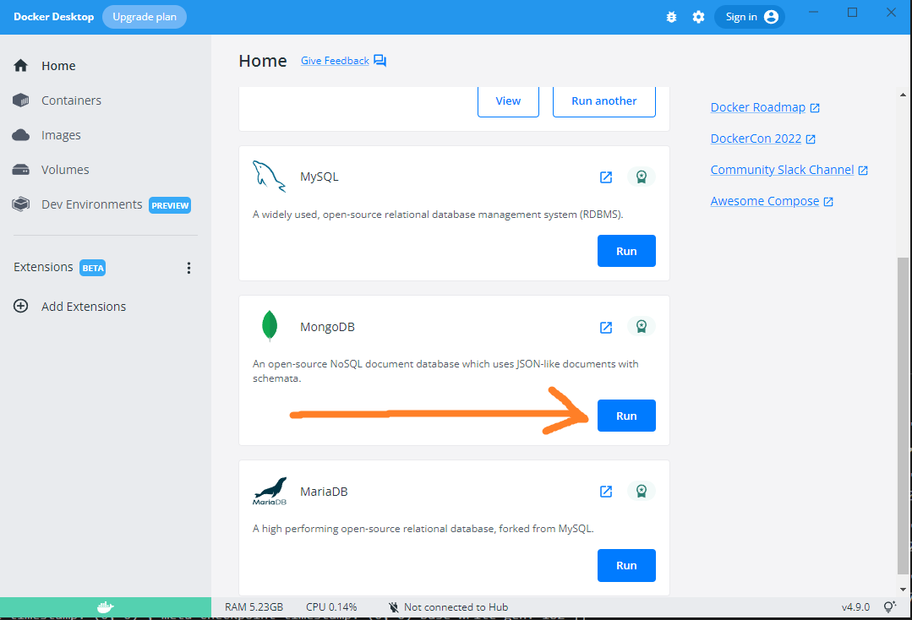
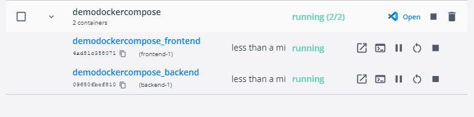

# [Bootcamp Web Developer Full Stack](https://www.thebridge.tech/bootcamps/bootcamp-fullstack-developer/)

### HTML, CSS, JS, ES6, Node.js, Frontend, Backend, Express, React, MERN, testing, DevOps

## DOCKER COMPOSE


Es una herramienta que te permite manejar aplicaciones que consisten en multiples contenedores de Docker. En lugar de tener múltiples Dockerfiles y estar ejecutando y vinculando uno por uno con Docker, definimos un archivo docker-compose.yml con la configuración que deseemos y lo ejecutamos, esto creará todos los servicios necesarios de nuestra aplicación. Además funciona en ambientes de desarrollo, producción, staging o testing, así como con servicios de integración continua.

Gracias a docker compose podremos conectar varios contenedores y comunicarlos entre sí.Por ejemplo si tenemos una aplicación fullstack, podríamos conectar nuestro contenedor que tenga la parte de **_front_** con **_back_**. Si lo hicieramos de manera independiente no podría funcionar

### Estructura de un archivo docker-compose.yml

Un archivo de docker-compose es simplemente un archivo con extensión y formato yml.

```
 touch docker-compose.yml
```

Para usarlo basta con crearlo y empezar a agregar el contenido.En este archivo se empieza especificando la versión de docker compose que se utilizará.
Para este ejemplo usaremos la versión 3.8. Después de la versión vienen anidada la sección de services. Puede haber tantos servicios como querramos; framework web, servidor web, base de datos, documentación, cache, etc. Cada servicio contará con sus propias variables de configuración y sus respectivos valores. Es todo, así de sencillo.

```
version: '3.8'
services:
  nombre_del_servicio:
    variable_de_configuracion:
      valores
    variable_de_configuracion:
      valores
  nombre_de_otro_servicio:
    variable_de_configuracion:
      valores
```

## Comandos de docker compose

Ayuda a construir la imagen, tras lo cual creará y lanzará los contenedores Docker.

```
docker-compose up
```

Inicia los contenedores de Docker, pero no crea imágenes ni crea contenedores; solo inicia los contenedores creados previamente.

```
docker-compose start
```

Detiene los servicios que se están ejecutando, pero los contenedores de instalación y las redes permanecen intactos.

```
docker-compose stop
```

Detiene los contenedores de Docker al igual que el comando «stop», pero no solo detiene los contenedores, sino que también los elimina.

```
docker-compose down
```

Elimina todos los volúmenes.

```
docker-compose down –volumes
```

Elimina todas las imágenes.

```
docker-compose down –rmi all
```

### EJEMPLO PRACTICO DOCKER COMPOSE

Para este ejemplo vamos a crear una aplicación fullstack . Crearemos contenedores de docker y gracias docker compose podremos conectarlos entre sí.

Para ello necesitamos lo siguiente:

1. Esta es la estructura de directorios que tendremos(No creeis todavía las carpetas):

```
/frontend
/backend
docker-compose.yaml
```

2. Primero vamos a crear nuestro front con React .Para ello en la terminal introducimos el siguiente comando:

```
npx create-react-app frontend
```

3. Editamos el componente **App** de **React** y pegamos el siguiente código:

```javascript 
import React, { useEffect, useState } from "react";

const App = () => {
  const [message, setMessage] = useState("");
  const [user, setUser] = useState("");

  useEffect(() => {
    fetch("test")
      .then((res) => res.json())
      .then((res) => {
        setMessage(res.message);
        setUser(res.user);
      });
  }, []);

 
  return (
    <div>
      <h1 style={{ textAlign: "center" }}>
        {message ? message : "No hay conexión con el backend"}
        <p>Usuario registrado en la bbdd :{user ? user.name : ""} </p>
      </h1>
    </div>
  );
};

export default App;
```

Cuando se cree , nos vamos a el fichero **package-json** dentro de **React** y agregamos al final del código la siguiente instrucción:

```js
  },
  "proxy": "http://backend:5000"
}

```

3. Creamos nuestro servidor de **NodeJs** , todo ello dentro de la carpeta **_backend_**

```
touch backend
```

```
npm init -y
```

Instalamos los siguientes paquetes

```
npm i express
```

Creamos el fichero del servidor

```
touch server.js
```

Agregamos dentro del package-json el comando **"start": node server.js** , para arrancar nuestro servidor con **"npm start"**

```js
"scripts": {
    "test": "echo \"Error: no test specified\" && exit 1",
    "start": "node server.js"
  },

```

Agregamos el siguiente código para crear un serviedor básico

```js 
const express =require("express")
const  route  = require("./routes/routes")
require("./database/config")
const app = express()

app.use(express.json())
 
app.use("/",route)

app.listen(5000,console.log("port 5000"))

```
Después creamos la carpeta **models** y creamos dentro él **demo.js**
```js
const mongoose = require("mongoose");
const Schema = mongoose.Schema;

let demoSchema = new Schema({
  name: String,
});

const demoModel = mongoose.model("pruebas", demoSchema);
module.exports = demoModel;


```
Acontinuación creamos la carpeta **routes** y creamos dentro él **routes.js**
```js
const router = require("express").Router();
const DemoModel = require("../models/demo");

router.get("/test", async (req, res) => {
  const usersData = await DemoModel.find();

  if (usersData.length == 0) {
    const user = new DemoModel({
      name: "usuario_1",
    });

    await user.save();
  } else {
    console.log(usersData);
  }

  res.json({ message: "Se accedió al backend con éxito",
  user: usersData[0] });
});

module.exports = router;


```

### Creación de archivos DockerFile y DockerCompose

Ahora dentro de la carpeta **_frontend_** y **_backend_** tenemos que crear un archivo **Dockerfile** que tendrá la configuración con la generaremos una imagen de docker de cada parte de nuestra aplicación. Es decir crearemos una imagen de docker de **frontend** y del **backend**

1. Dockerfile del **frontend**

```docker
FROM node:18.2.0-alpine3.14

WORKDIR /app

COPY package.json .

RUN npm install

COPY . .

EXPOSE 3000

CMD [ "npm", "start" ]
```

2. Dockerfile del **backend**

```docker
FROM node:18.2.0-alpine3.14

WORKDIR /app

COPY package.json .

RUN npm install

COPY . .

EXPOSE 5000

CMD ["npm", "start"]


```

3. Por ultimo en la raiz de nuestro proyecto(Fuera de las carpetas frontend y backend) creamos nuestro **docker-compose**
```
touch docker-compose.yaml
```
```docker
version: "3.8"
services:
   
  backend:
    build: ./backend
    ports:
      - "5000:5000"
    volumes:
      - logs:/app/logs
      - ./backend:/app
      - /app/node_modules
   
  frontend:
    build: ./frontend
    ports:
      - "3000:3000"
    volumes:
      - ./frontend/src:/app/src
    stdin_open: true
    tty: true
    depends_on:
      - backend
  mongo:
      image: mongo
      ports:
        - "27018:27018"
      command: mongod --port 27018 --bind_ip_all

 
volumes:
  data:
  logs:
```

4. Descargamos la imagen de mongodb desde dockerhub, para ello nos vamos **"Docker Desktop"** , buscamos en la lista la imagen de mongo y la descargamos pulsando en **"run"**



5. Ahora después de crear las 2 imagenes y crear los ficheros de configuración de docker, ahora generamos un **docker-compose** con el siguiente comando.Como resultado obtendremos un contenedor con 2 subcontenedores, en este caso un contenedor con nuestro **frontend** y otro con nuestro **backend**

```
docker-compose up
```
